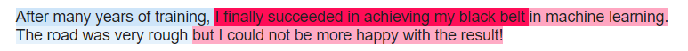

# BERT, explain yourself! 📖

It has been over two years since transformer models took the NLP throne 🏅, but up until recently they couldn't tell you how they got to their prediction. Not anymore!

```python
>>> BERT('After many years of training I finally succeeded in achieving '
         'my black belt in machine learning. The road was very rough but '
         'I could not be more happy with the result!')
Sentiment: 99% Positive

>>> BERT, explain yourself!
As you wish:
```



As you might have guessed from the colors, BERT has learned to harness the power of SHAP! SHAP is a game theoretic approach to explain the output of any machine learning model. Darker shades of pink indicate a positive contribution and the shades of blue indicate a negative contribution to the sentiment. This enables us to get an understanding of what goes on under the hood and not take predictions at their face value.

---

This notebook gives you an introduction on how to use **SHAP** an open-source explainability toolkit in your latest 🤗 Transformers pipeline.

We recommend to open the notebook using Colab to for an interactive explainable experience and optimal rendering of the visuals 👇:

[](https://colab.research.google.com/github/ml6team/quick-tips/blob/main/nlp/2021_04_22_shap_for_huggingface_transformers/explainable_transformers_using_shap.ipynb)
