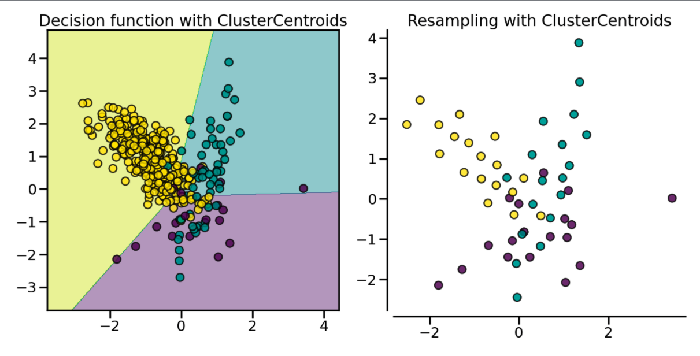
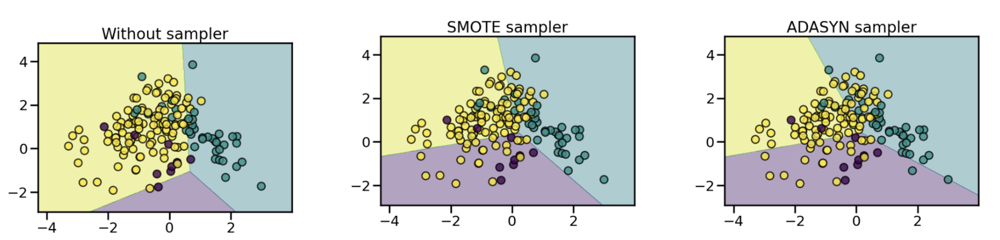

# 5 Tips to start working with imbalanced datasets

## 1. Select the right metric

* Accuracy is a **bad choice**
  * You'll get 99% accuracy for a 99/1 class imbalance if you always predict the majority class.
  * Have a look at 'balanced accuracy' instead!
* TPR, FPR and ROC AUC are a **slightly better choice**
  * Note that the ROC curve is not a good visual illustration for highly imbalanced data, because the FPR does not drop drastically when the Total Real Negatives is huge. Take the whole confusion matrix into account!
* F1 score and AUPR are the **best choice**
  * The focus of the (Area Under) Precision-Recall curve on the minority class makes it an effective diagnostic for imbalanced classification models.

## 2. Under-sample the majority class

There are 2 stragies to consider:

| Strategy                                                             | Method             |                                                                                                                |
| -------------------------------------------------------------------- | ------------------ | -------------------------------------------------------------------------------------------------------------- |
| Prototype selection (select samples from the original dataset)       | *Random*           | Randomly select prototypes.                                                                                    |
|                                                                      | *NearMiss*         | Adding heuristics in order to filter prototypes in a smarter way. (→ 3 different implementations in imblearn!) |
|                                                                      | *Tomek's links*    | Keeping every two samples from different classes that are the nearest neighbors of each other.                 |
| Prototype generation (generate samples based on majority class data) | *ClusterCentroids* | Selecting the centroids of K-means                                                                             |

Illustration of Tomek's links:


Cluster centroids example with [imbalanced-learn](https://pypi.org/project/imbalanced-learn/) (previously `imblearn`):

```python
from collections import Counter

from sklearn.datasets import make_classification
from imblearn.under_sampling import ClusterCentroids

X, y = make_classification(n_samples=5000, n_features=2, n_redundant=0,
                          n_classes=3, n_clusters_per_class=1,
                          weights=[0.01, 0.05, 0.94], random_state=0)
print(sorted(Counter(y).items())) # [(0, 64), (1, 262), (2, 4674)]
X_resampled, y_resampled = ClusterCentroids().fit_resample(X, y)
print(sorted(Counter(y_resampled).items())) # [(0, 64), (1, 64), (2, 64)]
```

The following image shows the dataset before and after resampling:



## 3. Over-sample the minority class

This can be done in 3 different ways:

* **Random sampling**: pretty straightforward.

* **SMOTE**: Generate synthetic data by interpolating between original data points. (There are many variants available; check the [documentation](https://imbalanced-learn.org/stable/over_sampling.html#smote-variants)! )

```python
from collections import Counter

from sklearn.datasets import make_classification
from imblearn.over_sampling import SMOTE

X, y = make_classification(n_samples=5000, n_features=2, n_redundant=0,
                          n_clusters_per_class=1, weights=[0.01, 0.99],
                          random_state=0)
print(sorted(Counter(y).items())) # [(0, 77), (1, 4923)]
X_resampled, y_resampled = SMOTE().fit_resample(X, y)
print(sorted(Counter(y_resampled).items())) # [(0, 4923), (1, 4923)]
```

* **ADASYN**: Same as SMOTE but puts more focus on harder to learn-neighborhoods by selecting samples that are wrongly classified using KNN.



## 4. Be careful for data leakage

**You should separate training and testing data before re-sampling.**

* Obvious reason: Wielding generative sampling approaches, you might end up with training data that is generated from test data.

* Not-so-obvious reason: Training data is sampled because we want to help the model better assess all labels. If we resample the test data too, we might digress from reality and get to a wrong/biased performance assessment.

Pro-tip: Use [sklearn Pipelines](https://imbalanced-learn.org/stable/references/generated/imblearn.pipeline.Pipeline.html) to conveniently keep an overview of the steps and minimize the risk of mistakes and data leakage when sampling.

## 5. Use built-in model functionality

1. `sklearn.utils.class_weight.compute_class_weight`

    example:

    ```python
    DecisionTreeClassifier(class_weight='balanced')
    ```

2. `scale_pos_weight` in XGBoost

    Rule of thumb:

    ```python
    scale_pos_weight = sum(negative_instances)/sum(positive_instances)
    ```

3. `class_weights` in Keras/TensorFlow

    Rule of thumb:

    ```python
    minority_class_weight = 1/(num_minority_examples/total_examples)/2
    majority_class_weight = 1/(num_majority_examples/total_examples)/2
    # Pass the weights to Keras in a dict with class name as keys
    keras_class_weights = {0: majority_class_weight, 1: minority_class_weight}
    ```

4. output layer bias in `tf.keras`

    Rule of thumb:

    ```python
    bias = log(num_minority_examples/num_majority_examples)
    ```

    Explanation: By setting the “correct” output bias we help the model converge faster.
    By default, the output layer bias is `log(1/1)=0` --> assumes balanced classes.

5. BigQueryML

    BigQuery provides a boolean flag when initializing a model object: `AUTO_CLASS_WEIGHTS=TRUE`.

## Author

* [@FlorentijnD](https://github.com/FlorentijnD)
