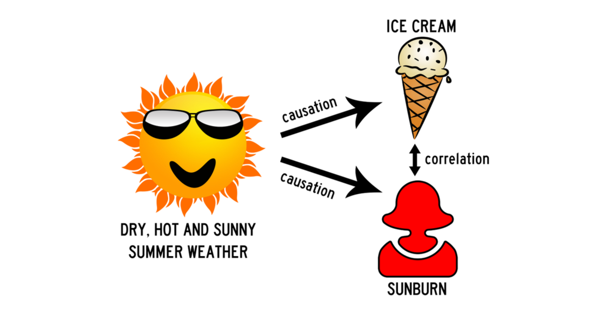
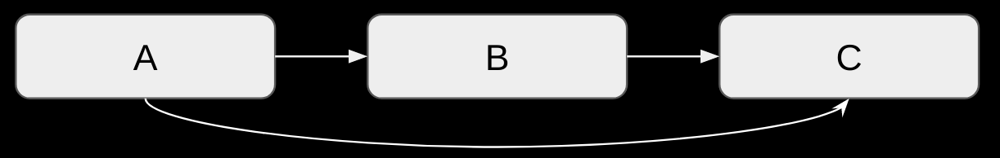
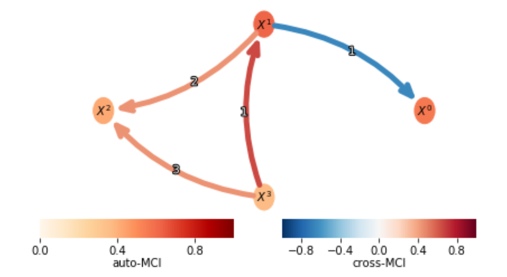

# Causality

## What is causality?
Causality in time series is a tricky thing. You want to find out which variables cause others.
The notion itself is very subtle and at the same time very strong. 

It's in essence a stronger way of looking at dynamics between variables than the well known correlation metric. 
Why? Well.. Let's prove it intuitively.
In the figure below you can expect that our three (time-series) variables are strongly correlated with each other.
It makes sense to say that having your skin burned has a strong correlation with the amount of ice creams you might eat on a given day.
However, this does not necessarily mean that eating ice cream causes skin burns!
Using causality analysis techniques, we can better model and find the _causal_ links between variables.
If our analysis was successful, we'd conclude that sunshine causes us to eat lots of ice cream and also causes our skin to burn.
The analysis would also show that there is no causal relationship between eating ice cream and getting your skin burnt, or vice versa.
Note that causality is a directional way of working, whereas correlation is not!

## Causality analysis as a guidance.
Keep in mind that causality analyses are in essence unsupervised techniques. 
There is really no way to check whether the results make sense at all.

In a experimental setting, people create toy datasets of which they determined the dynamics (linear and non-linear mathematical equations) upfront. Examples:

-  [this towardsdatascience article](https://towardsdatascience.com/causality-931372313a1c)
-  [the original paper of PCMCI](https://advances.sciencemag.org/content/5/11/eaau4996)
-  [this paper which compares causality techniques](https://arxiv.org/pdf/2104.08043v1.pdf)

Typically, the internal dynamics are unknown or too hard to try to model (think about complex physical processes). In such cases, causality is merely a tool to represent the dynamics of the system.
That's why results of causality analysis should be checked with the knowledge of experts. Try to make sure you are close to this expertise in your causality projects!

## Context

The notion of causality is not new and can be traced back to the [Vedic period]{https://en.wikipedia.org/wiki/Vedic_period#:~:text=The%20Vedic%20period%2C%20or%20the,%2C%20including%20the%20Vedas%20(ca.} which also brought about the well known concept of Karma. Next to a concept, causality nowadays has a practical and theoretical framework. Establishing this framework is possbile due to advanced mathematical and statistical sciences, coupled with an increase in computational power and our ability to capture digital data, and thereby, processes around us.

## Approaches
The earliest notion of this theoretical causality in time series is **granger causality**, put forward by [Granger in 1969](https://en.wikipedia.org/wiki/Granger_causality. 
We say that a variable *X* that evolves over time *Granger-causes* another evolving variable *Y* if predictions of the value of *Y* based on its own past values *and* on the past values of *X* are better than predictions of *Y* based only on *Y'*s own past values.

> Just like with all other approaches mentioned in this section, the time series must be made stationary first! We provide [code](../2021_02_08_timeseries_getting_started/time_series_getting_started.ipynb) that automatically checks for stationarity and by differencing tries to make the time series stationary if that's not the case already.

Granger causality works fine when you want to check for two variables whether one causes the other in a _linear_ way. There exist methods (non-parametric ways) to also look out for _non-linear_ causal interactions. We advocate to use these at all times, except if you're certain that the underlying complexity is linear by nature.

Enter **Transfer Entropy**! [This article](https://towardsdatascience.com/causality-931372313a1c) gives a good overview of the differences and the similarities between Transfer Entropy (developed in 2000) and Granger Causality. In short, Transfer Entropy is the non-linear variant of granger causality and has proven to be the most intuitive and performant (quality and consistency of results) method in our current toolbox. We advocate [this python implementation](https://pypi.org/project/PyCausality/). The code itself is not maintained anymore but still works well. As the pip package is unstable, it's easier to just copy the source code and go off from there, which we already did for you :-). Check out the [code](./src/transfer_entropy/transfer_entropy_wrapper.py)!

A more recent (2015) approach to causality is [PCMCI](https://github.com/jakobrunge/tigramite/). It was originally developed to find causal interactions in highly dimensional time series. This package is also able to _condition out_ variables. 

> **What does conditioning out mean in this context?** When a variable A is causing a variable B, and variable B causes variable C, then A is causing C to some degree as well. If B is not adding extra significant information to C, compared to A, then PCMCI will not end up showing the causal link between B and C, but will only output that A causes C.

**PCMCI** is a two phased approach: 

1. PC: condition selection algorithm (finds relevant parents to target variables)
		This first removes the variables that are not even conditionally dependent by independence testing.
		Then, the conditional dependence for the strongest dependent variables are checked
		→ This is done iteratively, until convergence

	→ Ending up with a list of relevant conditions (=relevant variables at a certain lag)

2. MCI:  “Momentary conditional independence”

	​	→ false positive control for highly-interdependent time series

	​	→ Also Identifies causal strength of a causal relationship

This two - phased approach is the skeleton of how PCMCI works. You have to instantiate PCMCI with a conditional independence test as well. Here, you have 5 options (see `tigramite.independence_tests` in the [documentation](https://jakobrunge.github.io/tigramite/)). Let's highlight some:

1. [`tigramite.independence_tests.CondIndTest`](https://jakobrunge.github.io/tigramite/#tigramite.independence_tests.CondIndTest) : This is the base class on which all actual independence tests are built.

2. [`tigramite.independence_tests.ParCorr`](https://jakobrunge.github.io/tigramite/#tigramite.independence_tests.ParCorr) : This test is based on correlation and works well for linear causal effects

3. [`tigramite.independence_tests.CMIknn`](https://jakobrunge.github.io/tigramite/#tigramite.independence_tests.CMIknn) : This test is a non-parametric test for continuous data that's based on KNN as the name suggests. It works well for

	- Non-linear dependencies

	- Additive *and* multiplicative noise

	It's computationally the most expensive option though. If you want more information, have a look at the [paper](https://core.ac.uk/download/pdf/211564416.pdf).

One of the most important parameters is alpha, denoting the “degree of conservativity”. The higher alpha, the quicker PCMCI will identify causal links higher risk for false positives. This value typically lies between 0.05 and 0.5. From our experiments, we've seen that that statement is correct most of the times (so not always). Running PCMCI with different values for alpha (e.g. [0.05, 0.1, 0.2, 0.4]) is a good idea! 

> Note that this alpha hyperparameter can be tuned automatically when alpha is set to `None` . That's at least what the documentation says, and that is correct for ParCorr, but not for other independence tests. See [this issue](https://github.com/jakobrunge/tigramite/issues/49) for more information.

One last thing! PCMCI has really nice visuals as output. You can see an example below.

 

 		The cross-MCI denotes how strong the causal link is between different variables. The auto-MCI scale denotes how strong the causal link is between current and past values (lags) for one specific variable (denoted as a node in the graph). The numbers denote the lags for which a causal link was found.

#### Try it out yourself!
Have a look in this repo to find out how TE and PCMCI can help you in your use-case! You can find [an example notebook](./src/Example%20notebook.ipynb) in the `src/` folder!

> Extra remark 1: In 2020, the creator of PCMCI has come up with an extension of PCMCI, named PCMCI+. From our projects and experiments, we have seen that PCMCI+ shows inconsistent results over different runs. Although PCMCI can (not in every case though) suffer from the same problem, it feels much more reliable. We therefore advocate not to use PCMCI+, except when your use-case has the need to check contemporaneous links, i.e. check whether A causes B, for both historic as well as current time steps instead of only historic time steps (see [PCMCI+ paper](http://proceedings.mlr.press/v124/runge20a.html)).

> Extra remark 2: In the PCMCI+ paper, the authors state that highly autocorrelated time series are challenging for most time series causality approaches and hints that that is also the case for (regular) PCMCI. You might want to keep this in mind when using PCMCI.